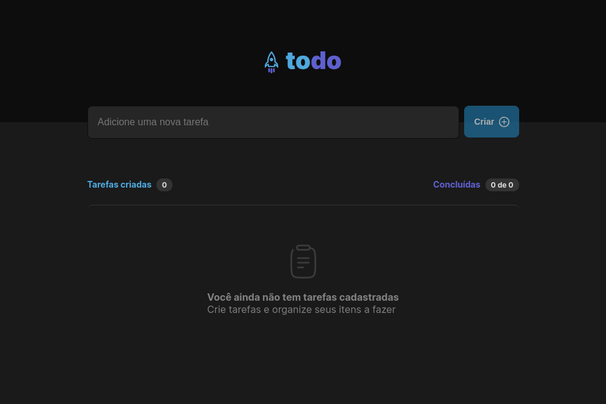

<h1 align="center"> Todo </h1>

Challeng concluído! Para consolidar os fundamentos do React e um pouco mais..

## 🚀 Tecnologias

Esse projeto foi desenvolvido com as seguintes tecnologias:

- ReactJs
- Vite
- TypeScript
- HTML & CSS
- Git e GitHub

## 💻 Projeto

 Desafio pratico do primeiro módulo do curso ReactJS da @Rocketseat.
 Nele eu coloquei em prática tudo que foi mostrado no módulo e mais um pouco.
 O projeto é um To-Do, para gerenciamento de tárefas do dia a dia.

---

Feito com ♥ by Atila Silva :wave: [Me siga no Instagram!](https://www.instagram.com/athilasils/)